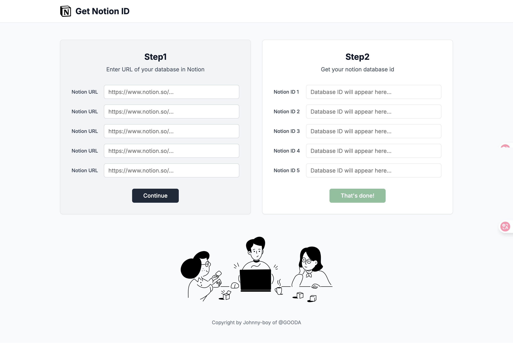

# Get Notion Database ID



A simple web application that helps you extract database IDs from Notion URLs. This tool makes it easy to get the clean database ID needed for API integrations and other development purposes.

## Features

- Extract Notion database IDs from various URL formats
- Support for both UUID and short ID formats
- Real-time URL validation
- Copy-to-clipboard functionality
- Responsive design for mobile, tablet, and desktop
- Process multiple URLs simultaneously

## How It Works

1. Enter your Notion database URL(s) in the input field(s)
2. The tool validates the URL format in real-time
3. Valid URLs automatically have their database IDs extracted
4. Click the copy icon to copy the ID to your clipboard

## Supported URL Formats

The tool supports various Notion URL formats, including:

- `https://www.notion.so/workspace/page-title-32characterhexadecimalstring`
- `https://www.notion.so/32characterhexadecimalstring`
- `https://www.notion.so/workspace/uuid-format-with-hyphens`
- `https://www.notion.so/uuid-format-with-hyphens`
- `https://notion.so/...` (same patterns as above)

## Development

This project is built with:

- Next.js (App Router)
- React
- TypeScript
- Tailwind CSS
- shadcn/ui components

### Getting Started

1. Clone the repository
2. Install dependencies:
   ```bash
   pnpm install
   ```

NOTICE!
`NPM v7+` is strict about dependency versions. If a package requires a specific version range and you have a conflicting version, npm will throw an error instead of installing potentially incompatible versions. You can use `npm install --legacy-peer-deps` or `npm install -force` to install deps.

